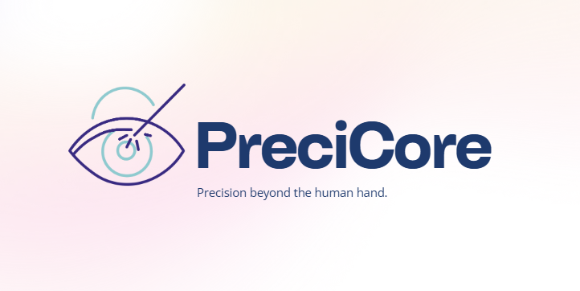

<div align="center">
  
  
  <br/>
  
  
  
  
  
  

  <br/>

  <a href="https://precicore.ca">🌐 precicore.ca</a> &nbsp;·&nbsp;
  <a href="https://github.com/poisnoir/spine-go">Spine-Go</a> &nbsp;·&nbsp;
  <a href="https://github.com/poisnoir/purifier">Purifier</a>

  <br/><br/>

  > *The world's first robotic assistant for corneal surgery.*  
  > Built by engineering students at Concordia University, Montreal.

</div>

---

## What is PreciCore?

Corneal transplantation is one of the most technically demanding procedures in medicine. The cornea is less than **0.5mm thick**, and a surgeon must place up to **24 sutures by hand** at micron-level precision. One bad stitch can leave a patient with worse vision than before the surgery.

PreciCore addresses this by combining **tremor suppression**, **motion scaling**, **force feedback**, and **camera-guided needle positioning** into a distributed robotic system — all connected over a communication protocol we built from scratch.

---

## Repositories

<table>
<tr>
<td width="50%">

### 🔗 [`spine-go`](https://github.com/poisnoir/spine-go)
**Robotics Communication Middleware**

Lightweight alternative to ROS 2, written in Go. Pub/sub and RPC over KCP/UDP, zero-config mDNS discovery, and AES-GCM encrypted namespaces. The real-time backbone connecting every PreciCore module.


</td>
<td width="50%">

### 🧠 [`crack-head-cpp`](https://github.com/poisnoir/crack-head-cpp)
**Physics Simulator**

MuJoCo-powered simulation environment for the PreciCore robotic arm and surgical scene. Validate control algorithms and needle trajectories on a virtual phantom cornea — before touching any hardware.


</td>
</tr>
<tr>
<td width="50%">

### 🌀 [`purifier`](https://github.com/poisnoir/purifier)
**Signal Filtering System**

Kalman filter-based tremor suppression and sensor noise reduction. Sits between raw operator input and the control system — turning shaky human movement into stable, precise commands.


</td>
<td width="50%">

### 🤖 `precicore` *(private)*
**Main Robot Control System**

Integrates all modules into a working end-to-end pipeline — from operator input through Purifier and Spine-Go, to the STM32-driven robotic arm and computer vision layer.


</td>
</tr>
</table>

---

## Architecture

```
Operator Input
      │
      ▼
 ┌─────────────┐
 │   Purifier  │  ← Kalman filter · tremor suppression · signal cleaning
 └──────┬──────┘
        │  Spine-Go (KCP/UDP · pub/sub · mDNS)
        ▼
 ┌─────────────────────────────────────────┐
 │              PreciCore Core             │
 │                                         │
 │  ┌─────────────┐   ┌─────────────────┐  │
 │  │  CrackHead  │   │   Robotic Arm   │  │
 │  │ (Simulator) │   │ STM32 · 5-DOF  │  │
 │  └─────────────┘   └────────┬────────┘  │
 │                             │           │
 │                    ┌────────▼────────┐  │
 │                    │  Vision System  │  │
 │                    │ Camera · OpenCV │  │
 │                    └─────────────────┘  │
 └─────────────────────────────────────────┘
        │
        ▼
  Phantom Cornea
```

---

## Roadmap

| Phase | Timeline | Focus |
|-------|----------|-------|
| **Phase 1** | Summer 2026 | Simulation & software — CrackHead, Purifier, Spine-Go integrated end-to-end |
| **Phase 2** | Fall/Winter 2026 | Hardware prototype — real robotic arm, force sensing, phantom cornea demo |
| **Phase 3** | Beyond 2027 | OCT integration, AI motion planning, custom haptic controller |

---

## Team

Built by Computer and Electrical Engineering students at **Concordia University's Gina Cody School of Engineering and Computer Science**, Montreal, QC.

---

<div align="center">

*Supported by **District 3**, Concordia University's startup incubator.*

<br/>

**[precicore.ca](https://precicore.ca)** &nbsp;·&nbsp; Montreal, QC &nbsp;·&nbsp; 2025–present

</div>
